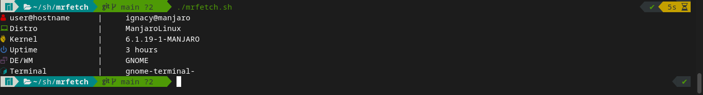

<div align="center">
    <h1>MrFetch</h1>
</div>

## A simple fetching program
<div align="center">
    
    
    
</div>
<details>
    <summary>Preview</summary>
    
</details>

## Installing:
```bash
$ make install
```

